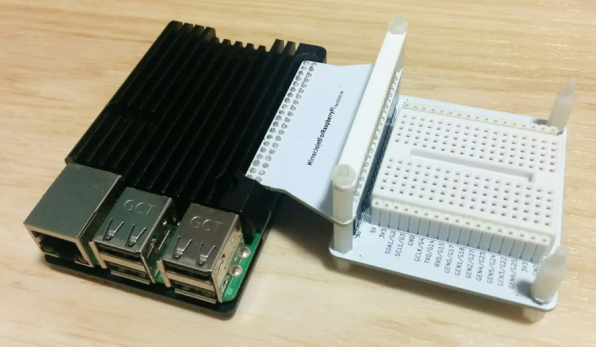

# SideBBForRaspberryPi

An expansion board for raspberry pi.

## References

- [Raspberry Piの信号線を横に配置したブレッドボードの左右に引き出す基板を作ってみた](https://asukiaaa.blogspot.com/2020/10/sidebb-for-raspberry-pi.html)
- [Raspberry Pi Mechanical Drawings](https://www.raspberrypi.org/documentation/hardware/raspberrypi/mechanical/README.md)
